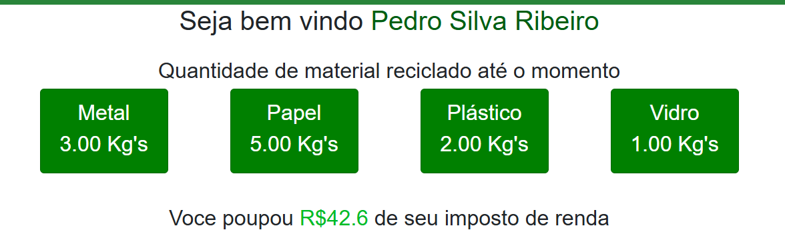

# Projeto MundoVere

Projeto realizado na aula de scripts, primeiro semestre de 2024, FATEC Mogi Mirim

## Objetivo

Um site onde é possivel cadastrar reciclagem feitas em postos específicos, ganhando desconto no imposto de renda para pessoas físicas.

## Como instalar

Na ultima atualização foi feita a conteinerização do aplicativo.

## Requisitos

- Docker

_Para instalar Docker no seu sistema siga o passo a passo do [site oficial](https://docs.docker.com/)_

- [Windows](https://docs.docker.com/desktop/install/windows-install/)
- [Linux](https://docs.docker.com/desktop/install/linux-install/)
- [Mac](https://docs.docker.com/desktop/install/mac-install/)

## Passo a passo

- Abra uma sessão do seu terminal na pasta do aplicativo
- Baixe a imagem do aplicativo usando o comando `docker pull peterpedro01/mundoverde:1.0.0`
- Começe a instalação do aplicativo usando o arquivo compose com o comando `docker-compose up -d` (_O -d faz com que o container rode no plano de fundo, fazendo que não seja necessário manter a janela aberta_)

Com todos esses passos concluidos o aplicativo estara disponivel em `127.0.0.1:8080` ou `localhost:8080`

_Obs: como teste o login e senha padrão do funcionario é 30100000/admin em um ambiente de produção isso jamais seria implementado dessa forma_

## Como parar e reiniciar após parada

Para parar a execução do aplicativo basta somente usar o comando `docker-compose stop` e para reiniciar após uma parada o comando é `docker-compose start`, garanta que sempre ao fazer isso esteja no mesmo diretório do arquivo `docker-compose.yml`

## Como deletar os containers

Para para e deletar o container o comando é `docker-compose down` **Cuidado ao fazer isso, pois o container do banco de dados também será parado e será necessário alterar o compose para selecionar o volume antigo**
